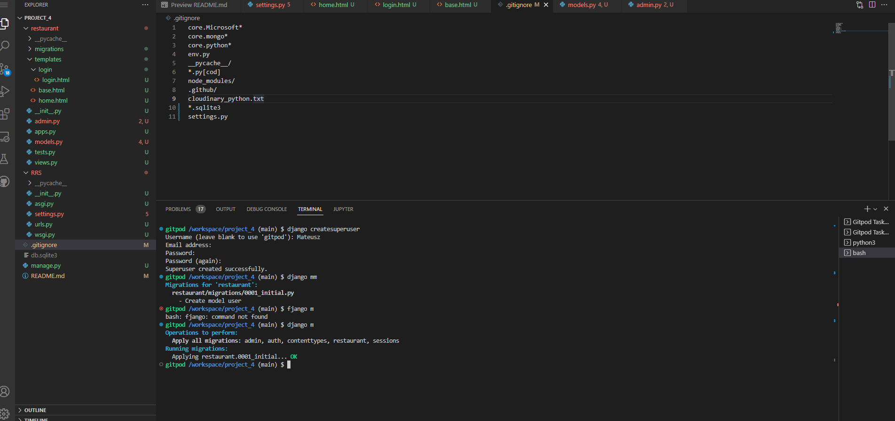
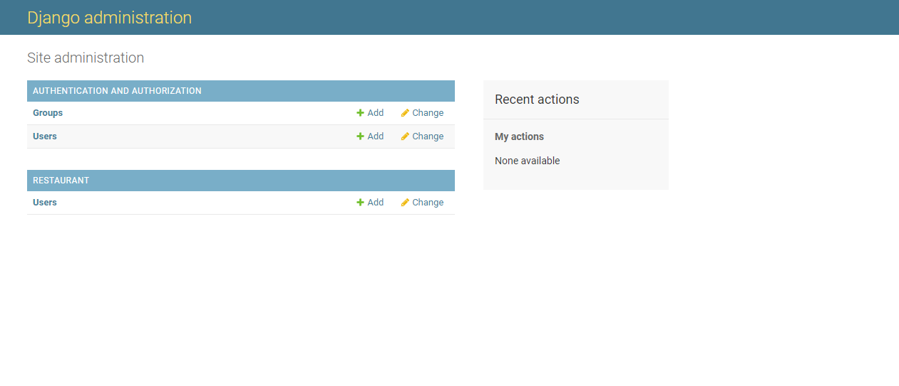

# I had several issues with creating this project mainly with setting up python as settings.py would delete itself and so would django
Here are the pictures of django working:

To access project follow the link below:

Type in python r

Then in the url add /admin